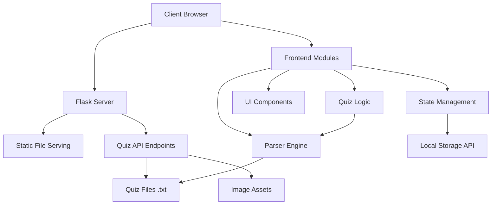
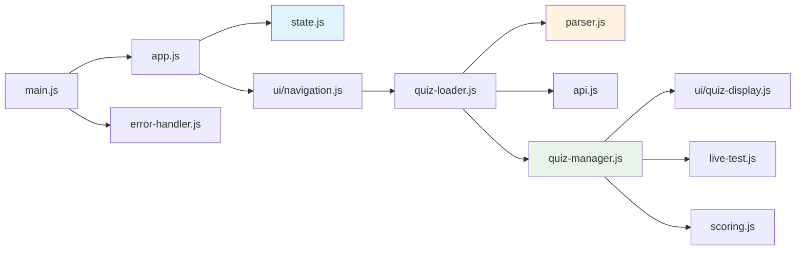

# Aviation Quiz Application

A modern, feature-rich quiz application built with Flask and vanilla JavaScript, designed for aviation maintenance training and certification preparation. Supports both single and multi-quiz modes with live feedback, progress tracking, and intelligent question validation.

---

## Table of Contents

- [Introduction](#introduction)
- [Key Features](#key-features)
- [Architecture Overview](#architecture-overview)
- [Getting Started](#getting-started)
  - [Prerequisites](#prerequisites)
  - [Installation](#installation)
  - [Running the Project](#running-the-project)
- [Configuration](#configuration)
  - [Environment Variables](#environment-variables)
  - [Application Settings](#application-settings)
- [Project Structure](#project-structure)
- [Usage Guide](#usage-guide)
  - [Creating Quizzes](#creating-quizzes)
  - [Quiz Format](#quiz-format)
  - [Multi-Quiz Mode](#multi-quiz-mode)
- [Development](#development)
  - [Contributing](#contributing)
  - [Code Style](#code-style)
- [Roadmap](#roadmap)
- [License](#license)

---

## Introduction

The Aviation Quiz Application is a comprehensive learning platform designed to help aviation maintenance professionals prepare for certification exams. Built with a focus on user experience and accessibility, it provides instant feedback, progress tracking, and flexible quiz management across desktop and mobile devices.

**Perfect for:**
- Aviation maintenance students
- Certification exam preparation
- Training organizations
- Self-paced learning

---

## Key Features

### 🎯 Core Functionality

- **Single & Multi-Quiz Modes**: Study from one quiz or combine multiple quizzes into a unified bank
- **Live Test Mode**: Get instant feedback on answers with color-coded indicators
- **Intelligent Question Validation**: Automatic detection and flagging of malformed quiz files
- **Level-Based Filtering**: Organize and filter questions by difficulty or topic
- **Progress Tracking**: Visual sidebar showing answered, correct, and incorrect questions
- **Image Support**: Display diagrams, schematics, and reference images within questions

### 📱 User Experience

- **Responsive Design**: Optimized for desktop, tablet, and mobile devices
- **Floating Controls**: Quick access to settings via floating action buttons
- **Smart Navigation**: Breadcrumb-style folder navigation with confirmation dialogs
- **Keyboard Shortcuts**: ESC to close modals, Enter to apply settings
- **Accessibility**: ARIA labels, semantic HTML, keyboard navigation support

### ⚙️ Advanced Features

- **Question Shuffling**: Randomize question and answer order for each session
- **Customizable Question Count**: Select how many questions to attempt
- **Score Analysis**: Detailed scoring with grade calculation and performance feedback
- **Quiz Validation**: Pre-flight checks for file format compliance
- **Session Persistence**: Resume quizzes with maintained state

---

## Architecture Overview

The application follows a modular frontend architecture with a lightweight Flask backend for file serving.



### Technology Stack

**Backend:**
- Flask 3.x (Python web framework)
- Werkzeug (WSGI utilities)

**Frontend:**
- Vanilla JavaScript (ES6 modules)
- jQuery 3.7.1 (DOM manipulation, animations)
- Font Awesome 6.4 (icons)
- Inter Font Family (typography)

**Architecture Pattern:**
- Modular ES6 with centralized state management
- Event-driven UI updates
- Separation of concerns (UI, logic, data)

---

## Getting Started

### Prerequisites

- **Python 3.8+** installed on your system
- **pip** (Python package manager)
- Modern web browser (Chrome, Firefox, Safari, Edge)

### Installation

1. **Clone the repository:**

```bash
git clone https://github.com/yourusername/aviation-quiz.git
cd aviation-quiz
```

2. **Create a virtual environment:**

```bash
# Windows
python -m venv venv
venv\Scripts\activate

# macOS/Linux
python3 -m venv venv
source venv/bin/activate
```

3. **Install dependencies:**

```bash
pip install -r requirements.txt
```

If `requirements.txt` doesn't exist, install Flask manually:

```bash
pip install Flask
```

4. **Verify quiz directory structure:**

Ensure the `list quizzes` directory exists in your project root:

```
aviation-quiz/
├── list quizzes/          # Quiz files directory
│   ├── Category 1/
│   │   └── quiz1.txt
│   └── quiz2.txt
├── public/
├── app.py
└── ...
```

### Running the Project

**Development Mode:**

```bash
python app.py
```

The application will start on `http://localhost:5000` by default.

**Production Mode:**

```bash
export FLASK_ENV=production  # macOS/Linux
set FLASK_ENV=production     # Windows

python app.py
```

**Custom Port:**

```bash
export PORT=8080  # macOS/Linux
set PORT=8080     # Windows

python app.py
```

---

## Configuration

### Environment Variables

| Variable | Description | Default | Example |
|----------|-------------|---------|---------|
| `PORT` | Server port number | `5000` | `8080` |
| `FLASK_ENV` | Flask environment | `development` | `production` |

### Application Settings

Edit `public/js/config.js` to customize application behavior:

```javascript
export const CONFIG = {
  // Quiz directory configuration
  QUIZ_DIRECTORY_NAME: 'list quizzes',
  QUIZ_DIRECTORY_IN_ROOT: true,  // true = root, false = public/
  
  // Quiz validation rules
  MAX_CONSECUTIVE_LINES: 5,
  MIN_CONSECUTIVE_LINES: 3,
  
  // Default settings
  DEFAULT_QUESTION_COUNT: 20,
  DEFAULT_LIVE_TEST_MODE: true,
  
  // Grade thresholds
  GRADE_THRESHOLDS: {
    A_PLUS: 90,
    A: 80,
    B: 70,
    C: 60
  }
};
```

**Key Configuration Options:**

- `QUIZ_DIRECTORY_IN_ROOT`: Set to `false` to place quizzes in `public/list quizzes/`
- `MAX_CONSECUTIVE_LINES`: Maximum lines per question (detects malformed files)
- `DEFAULT_LIVE_TEST_MODE`: Enable/disable live feedback by default
- `GRADE_THRESHOLDS`: Customize grade percentage ranges

---

## Project Structure

```
aviation-quiz/
├── app.py                          # Flask application entry point
├── requirements.txt                # Python dependencies
├── list quizzes/                   # Quiz files directory (configurable)
│   ├── Category 1/
│   │   ├── quiz1.txt
│   │   └── quiz2.txt
│   └── quiz3.txt
│
├── public/                         # Static frontend files
│   ├── index.html                  # Main HTML file
│   ├── styles.css                  # Application styles
│   ├── images/                     # Question images
│   │   └── placeholder.png
│   │
│   └── js/                         # JavaScript modules
│       ├── main.js                 # Application entry point
│       ├── config.js               # Configuration settings
│       │
│       └── modules/
│           ├── app.js              # Core initialization
│           ├── state.js            # Centralized state management
│           ├── api.js              # Backend API calls
│           ├── parser.js           # Question parsing logic
│           ├── utils.js            # Utility functions
│           ├── error-handler.js    # Global error handling
│           ├── jquery-enhancements.js
│           ├── quiz-loader.js      # Quiz content loading
│           ├── quiz-settings.js    # Settings management
│           ├── quiz-controls.js    # Control state
│           ├── quiz-manager.js     # Main quiz logic
│           ├── scoring.js          # Score calculation
│           ├── live-test.js        # Live test functionality
│           │
│           └── ui/
│               ├── navigation.js   # Quiz list & folders
│               ├── controls.js     # Floating panels
│               ├── notifications.js
│               ├── loading.js
│               ├── modal.js        # Image modal
│               ├── quiz-display.js # Question rendering
│               └── progress.js     # Progress tracking
│
└── README.md                       # This file
```

### Module Responsibilities



---

## Usage Guide

### Creating Quizzes

Quiz files are simple text files (`.txt`) with a specific format:

#### Basic Quiz Format

```
What is the primary purpose of a wing? (Level 1)
To generate lift
@@To provide structural support for the aircraft
To house fuel tanks
To improve aerodynamics

Which tool is used to measure torque? (Level 2)
Micrometer
@@Torque wrench
Dial indicator
Calipers

What does ATA stand for? (Level 1, Level 2)
@@Air Transport Association
Aviation Technical Alliance
Aircraft Testing Authority
Aeronautical Training Academy
```

**Format Rules:**

1. **Questions and Answers**: Separated by blank lines
2. **Question Line**: First line of each block
3. **Correct Answer**: Prefix with `@@`
4. **Levels**: Add in parentheses at end of question line
5. **Images**: Use `[IMG:filename.png]` syntax

#### Advanced Features

**Multiple Levels:**
```
What is the stall speed of a Cessna 172? (Level 2, Level 3)
40 knots
@@48 knots
55 knots
60 knots
```

**With Images:**
```
Identify the component shown in the diagram. [IMG:engine-diagram.png]
Carburetor
@@Fuel injector
Oil pump
Alternator
```

**Multiple Images:**
```
Match the schematic to the correct system. [IMG:schematic1.png] [IMG:schematic2.png]
Electrical system
@@Hydraulic system
Fuel system
Pneumatic system
```

### Multi-Quiz Mode

Combine multiple quizzes into a single unified question bank:

1. Navigate to a folder containing multiple quiz files
2. Check the boxes next to desired quizzes
3. Click **"Start Combined Quiz"**
4. Questions from all selected quizzes will be shuffled together

**Benefits:**
- Comprehensive review across multiple topics
- Randomized question order from different sources
- Single session for broad exam preparation

---

## Development

### Contributing

We welcome contributions! Please follow these steps:

1. **Fork the repository**
2. **Create a feature branch:**
   ```bash
   git checkout -b feature/amazing-feature
   ```
3. **Commit your changes:**
   ```bash
   git commit -m 'Add amazing feature'
   ```
4. **Push to the branch:**
   ```bash
   git push origin feature/amazing-feature
   ```
5. **Open a Pull Request**

### Code Style

**JavaScript:**
- ES6+ syntax with modules
- JSDoc comments for functions
- Meaningful variable names
- Single responsibility principle

**Python:**
- PEP 8 style guide
- Type hints where applicable
- Docstrings for functions

**CSS:**
- CSS custom properties for theming
- BEM-like naming conventions
- Mobile-first responsive design

### Testing Guidelines

**Before submitting a PR:**

1. Test across browsers (Chrome, Firefox, Safari)
2. Verify responsive design on mobile devices
3. Check console for errors
4. Validate quiz file parsing with edge cases
5. Test both single and multi-quiz modes

---

## Roadmap

### v2.0 - Enhanced Learning Features
- [ ] Quiz creation interface (web-based editor)
- [ ] Performance analytics dashboard
- [ ] Spaced repetition algorithm
- [ ] Export results to PDF/CSV

### v2.1 - Collaboration Features
- [ ] User accounts and authentication
- [ ] Shared quiz banks
- [ ] Leaderboards
- [ ] Study groups

### v2.2 - Advanced Quiz Types
- [ ] True/False questions
- [ ] Multiple selection (checkboxes)
- [ ] Fill-in-the-blank
- [ ] Drag-and-drop matching

### v3.0 - Mobile App
- [ ] React Native mobile application
- [ ] Offline quiz support
- [ ] Push notifications for study reminders
- [ ] Cloud sync

---

## License

This project is licensed under the **MIT License**.

```
MIT License

Copyright (c) 2024 [Your Name]

Permission is hereby granted, free of charge, to any person obtaining a copy
of this software and associated documentation files (the "Software"), to deal
in the Software without restriction, including without limitation the rights
to use, copy, modify, merge, publish, distribute, sublicense, and/or sell
copies of the Software, and to permit persons to whom the Software is
furnished to do so, subject to the following conditions:

The above copyright notice and this permission notice shall be included in all
copies or substantial portions of the Software.

THE SOFTWARE IS PROVIDED "AS IS", WITHOUT WARRANTY OF ANY KIND, EXPRESS OR
IMPLIED, INCLUDING BUT NOT LIMITED TO THE WARRANTIES OF MERCHANTABILITY,
FITNESS FOR A PARTICULAR PURPOSE AND NONINFRINGEMENT. IN NO EVENT SHALL THE
AUTHORS OR COPYRIGHT HOLDERS BE LIABLE FOR ANY CLAIM, DAMAGES OR OTHER
LIABILITY, WHETHER IN AN ACTION OF CONTRACT, TORT OR OTHERWISE, ARISING FROM,
OUT OF OR IN CONNECTION WITH THE SOFTWARE OR THE USE OR OTHER DEALINGS IN THE
SOFTWARE.
```

---

## Support

- **Issues**: [GitHub Issues](https://github.com/yourusername/aviation-quiz/issues)
- **Discussions**: [GitHub Discussions](https://github.com/yourusername/aviation-quiz/discussions)
- **Email**: support@aviationquiz.com

---

## Acknowledgments

- Font Awesome for icons
- Inter font family by Rasmus Andersson
- jQuery team for DOM manipulation utilities
- Aviation maintenance community for feedback and testing

---

**Built with ❤️ for the aviation community**